# State machines

Documented for version: 0.23.0

Most things in a world move through a lifecycle kept in a `status` column
(server `src/db/*.ts`, mirrored by the solo engine in
`client/scripts/local/`). No single module owns these machines: each
transition happens in a command (`src/commands/`, a player's request) or a
scheduled event (`src/scheduler/`, the handler named on the arrow). This page
draws them all in one place.

**Keeping it current.** Review this page whenever the version in
`client/project.godot` is bumped for a release. Check it against what changed
since the last tag, then set the version line above to the new version.
`server/test/state-machines.test.ts` fails until the two versions match. It
also fails if a status value in the code is missing from its section here.

How to read the diagrams:
- Labels name the event handler (`snake_case`) or the player command that
  moves an entity. Plain words describe a rule that fires inside another
  handler.
- `[*]` at the end means the row is gone (deleted), or the state is final.

Contents: [World](#world) · [Wave (horde)](#wave-horde) ·
[Battle](#battle) · [Army](#army) · [Hero](#hero) · [General](#general) ·
[Caravan](#caravan) · [Expedition (settlers)](#expedition-settlers) ·
[Scout mission](#scout-mission) · [Ruin search](#ruin-search) ·
[Road](#road) · [River crossing](#river-crossing) ·
[Fort and supply point](#fort-and-supply-point) · [Camp](#camp) ·
[Ancient site](#ancient-site) ·
[Shipyard and mountain city](#shipyard-and-mountain-city) ·
[Research](#research) · [Kalinov Bridge](#kalinov-bridge) ·
[Enemy leader](#enemy-leader) · [Bounty](#bounty) · [Village](#village)

## World

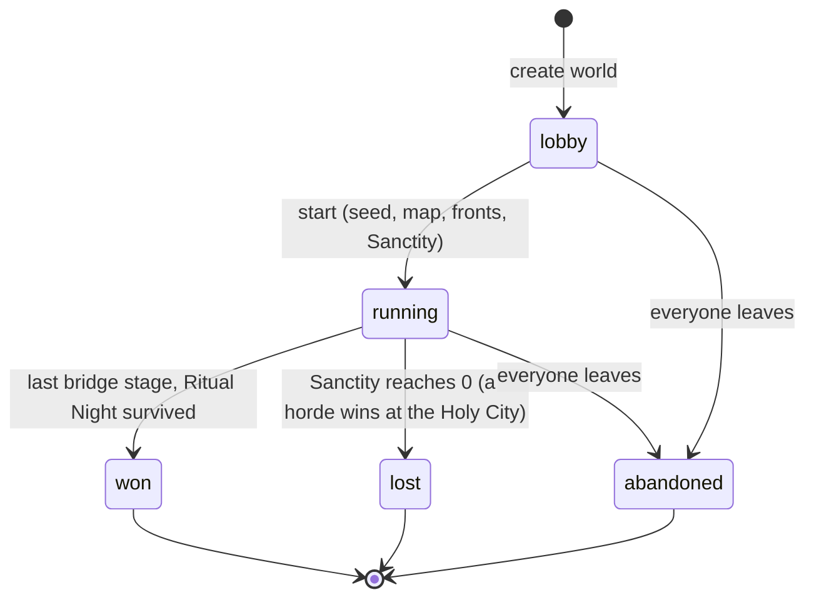
```mermaid
stateDiagram-v2
  [*] --> lobby: create world
  lobby --> running: start (seed, map, fronts, Sanctity)
  lobby --> abandoned: everyone leaves
  running --> won: last bridge stage, Ritual Night survived
  running --> lost: Sanctity reaches 0 (a horde wins at the Holy City)
  running --> abandoned: everyone leaves
  won --> [*]
  lost --> [*]
  abandoned --> [*]
```

The worker runs no events for a world that is `won`, `lost` or `abandoned`.

## Wave (horde)

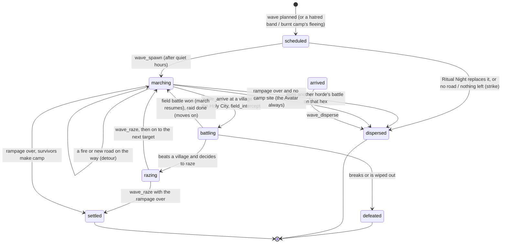
```mermaid
stateDiagram-v2
  [*] --> scheduled: wave planned (or a hatred band / burnt camp's fleeing)
  scheduled --> marching: wave_spawn (after quiet hours)
  scheduled --> dispersed: Ritual Night replaces it, or no road / nothing left (strike)
  marching --> battling: wave_arrive at a village or the Holy City, field_intercept
  marching --> dispersed: joins another horde's battle on that hex
  marching --> marching: a fire or new road on the way (detour)
  battling --> marching: field battle won (march resumes), raid done (moves on)
  battling --> razing: beats a village and decides to raze
  battling --> defeated: breaks or is wiped out
  razing --> marching: wave_raze, then on to the next target
  razing --> settled: wave_raze with the rampage over
  marching --> settled: rampage over, survivors make camp
  marching --> dispersed: rampage over and no camp site (the Avatar always)
  arrived --> dispersed: wave_disperse
  defeated --> [*]
  dispersed --> [*]
  settled --> [*]
```

- `arrived` survives only from old worlds: hordes that camped at an unguarded
  Holy City. New hordes never enter it.
- `settled` creates a [camp](#camp).
- The **Avatar of Černobog** (errand `avatar`) and the **Leshen** (errand
  `leshen`) never settle. Their rampage has no end until no player village
  stands. They always raze, then march on the Holy City.
- A **band sent at the bridge's builders** (errand `bridge`, one for each of
  the group's villages, setting out a few hours after a stage starts to be
  raised) moves on from each village it strikes to the nearest one it hasn't
  struck yet, then to the Holy City.

## Battle

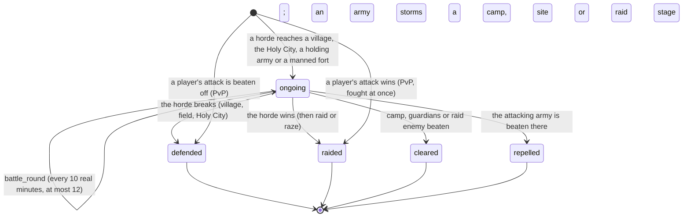
```mermaid
stateDiagram-v2
  [*] --> ongoing: a horde reaches a village, the Holy City, a holding army or a manned fort; an army storms a camp, a site or a raid stage
  ongoing --> ongoing: battle_round (every 10 real minutes, at most 12)
  ongoing --> defended: the horde breaks (village, field, Holy City)
  ongoing --> raided: the horde wins (then raid or raze)
  ongoing --> cleared: camp, guardians or raid enemy beaten
  ongoing --> repelled: the attacking army is beaten there
  [*] --> raided: a player's attack wins (PvP, fought at once)
  [*] --> defended: a player's attack is beaten off (PvP)
  defended --> [*]
  raided --> [*]
  cleared --> [*]
  repelled --> [*]
```

Fights resolved at once (camps, sites, raid stages) go from `ongoing` to
their end in the same handler. A maneuver under way and a breakthrough
(battle.json lines) ride in the battle's setup (`lines`), not its status.

## Army

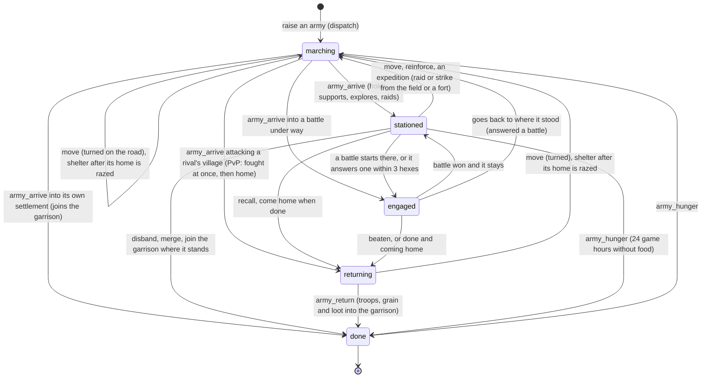
```mermaid
stateDiagram-v2
  [*] --> marching: raise an army (dispatch)
  marching --> stationed: army_arrive (holds, supports, explores, raids)
  marching --> engaged: army_arrive into a battle under way
  marching --> marching: move (turned on the road), shelter after its home is razed
  marching --> done: army_arrive into its own settlement (joins the garrison)
  marching --> returning: army_arrive attacking a rival's village (PvP: fought at once, then home)
  stationed --> engaged: a battle starts there, or it answers one within 3 hexes
  stationed --> marching: move, reinforce, an expedition (raid or strike from the field or a fort)
  stationed --> returning: recall, come home when done
  stationed --> done: disband, merge, join the garrison where it stands
  engaged --> stationed: battle won and it stays
  engaged --> returning: beaten, or done and coming home
  engaged --> marching: goes back to where it stood (answered a battle)
  returning --> marching: move (turned), shelter after its home is razed
  returning --> done: army_return (troops, grain and loot into the garrison)
  stationed --> done: army_hunger (24 game hours without food)
  marching --> done: army_hunger
  done --> [*]
```

- **Shelter.** An army whose home is razed turns for its owner's nearest
  standing village, then the owner's refugee camp, then an ally's village (as
  `support`).
- **Quarters.** A `stationed` army in a settlement, fort or supply point is
  quartered (`quarteredAt`). That is a flag, not a state.
- **Enemy lands.** An army can march to and hold a hex beyond the map's edge
  (`sim/enemyLands.ts`), with the same states as on the map. Arriving in a
  band of a front's enemy lands reveals the band past it (`enemy_sight` on
  the world, not a status).

## Hero

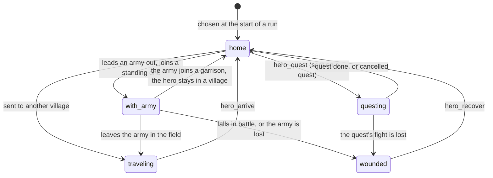
```mermaid
stateDiagram-v2
  [*] --> home: chosen at the start of a run
  home --> with_army: leads an army out, joins a standing one
  home --> traveling: sent to another village
  home --> questing: hero_quest (sent on a quest)
  traveling --> home: hero_arrive
  with_army --> home: the army joins a garrison, the hero stays in a village
  with_army --> traveling: leaves the army in the field
  with_army --> wounded: falls in battle, or the army is lost
  questing --> home: quest done, or cancelled
  questing --> wounded: the quest's fight is lost
  wounded --> home: hero_recover
```

## General

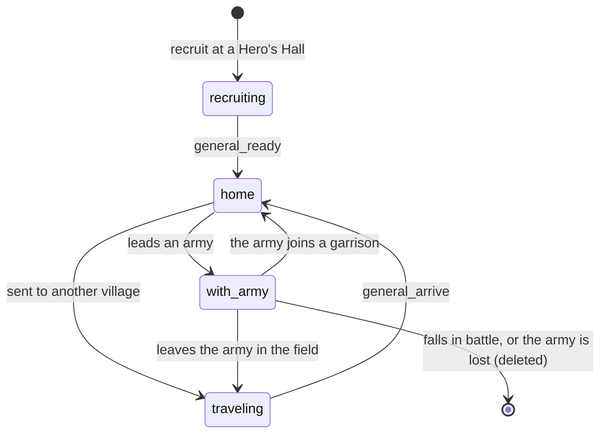
```mermaid
stateDiagram-v2
  [*] --> recruiting: recruit at a Hero's Hall
  recruiting --> home: general_ready
  home --> with_army: leads an army
  home --> traveling: sent to another village
  traveling --> home: general_arrive
  with_army --> home: the army joins a garrison
  with_army --> traveling: leaves the army in the field
  with_army --> [*]: falls in battle, or the army is lost (deleted)
```

## Caravan

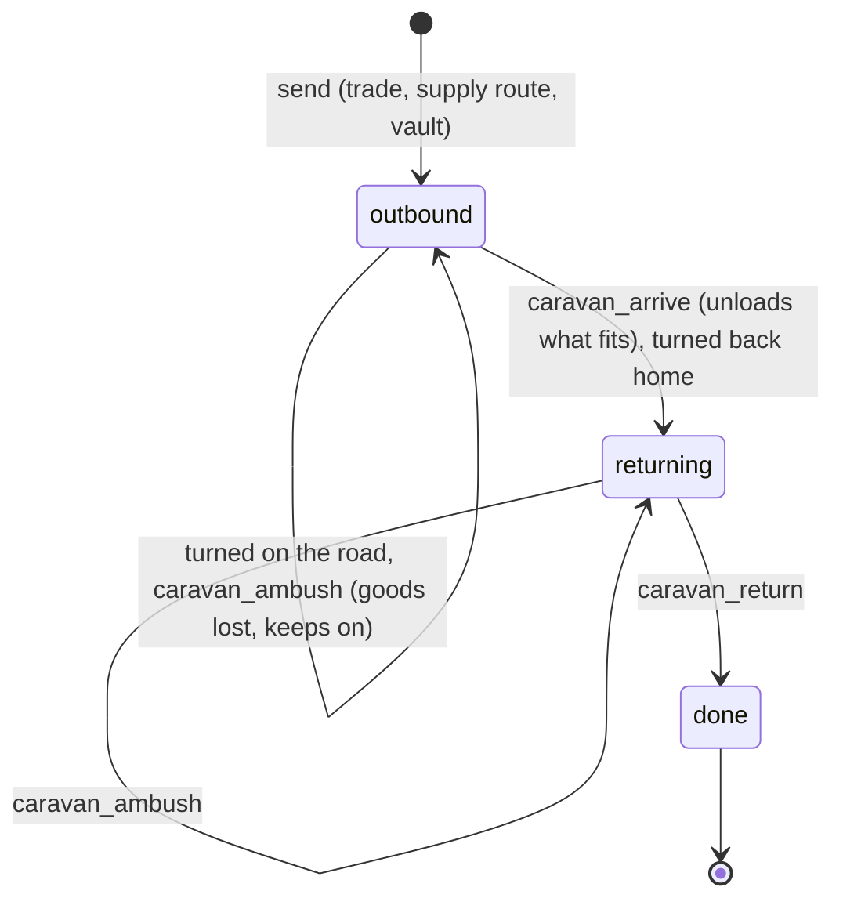
```mermaid
stateDiagram-v2
  [*] --> outbound: send (trade, supply route, vault)
  outbound --> outbound: turned on the road, caravan_ambush (goods lost, keeps on)
  outbound --> returning: caravan_arrive (unloads what fits), turned back home
  returning --> returning: caravan_ambush
  returning --> done: caravan_return
  done --> [*]
```

## Expedition (settlers)

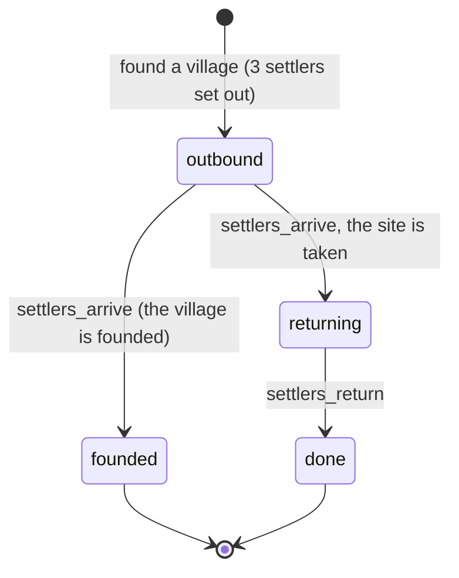
```mermaid
stateDiagram-v2
  [*] --> outbound: found a village (3 settlers set out)
  outbound --> founded: settlers_arrive (the village is founded)
  outbound --> returning: settlers_arrive, the site is taken
  returning --> done: settlers_return
  founded --> [*]
  done --> [*]
```

## Scout mission

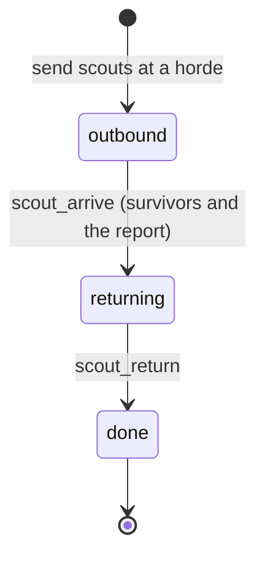
```mermaid
stateDiagram-v2
  [*] --> outbound: send scouts at a horde
  outbound --> returning: scout_arrive (survivors and the report)
  returning --> done: scout_return
  done --> [*]
```

## Ruin search

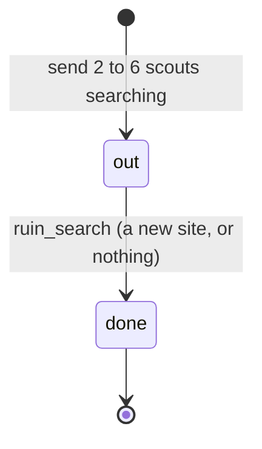
```mermaid
stateDiagram-v2
  [*] --> out: send 2 to 6 scouts searching
  out --> done: ruin_search (a new site, or nothing)
  done --> [*]
```

Where (or whether) the scouts find a ruin is settled when they set out
(`plan`), and sets when `ruin_search` falls due.

## Road

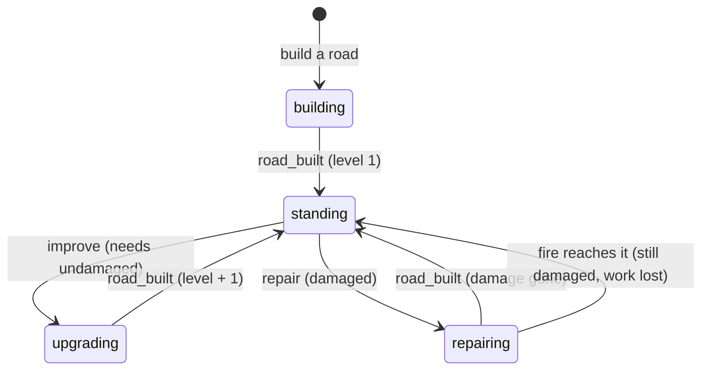
```mermaid
stateDiagram-v2
  [*] --> building: build a road
  building --> standing: road_built (level 1)
  standing --> upgrading: improve (needs undamaged)
  upgrading --> standing: road_built (level + 1)
  standing --> repairing: repair (damaged)
  repairing --> standing: road_built (damage gone)
  repairing --> standing: fire reaches it (still damaged, work lost)
```

`damaged` is a flag beside the status. A fire sets it on every road into the
burning hex that is not `building`. A damaged road can't be improved until
it is repaired.

## River crossing

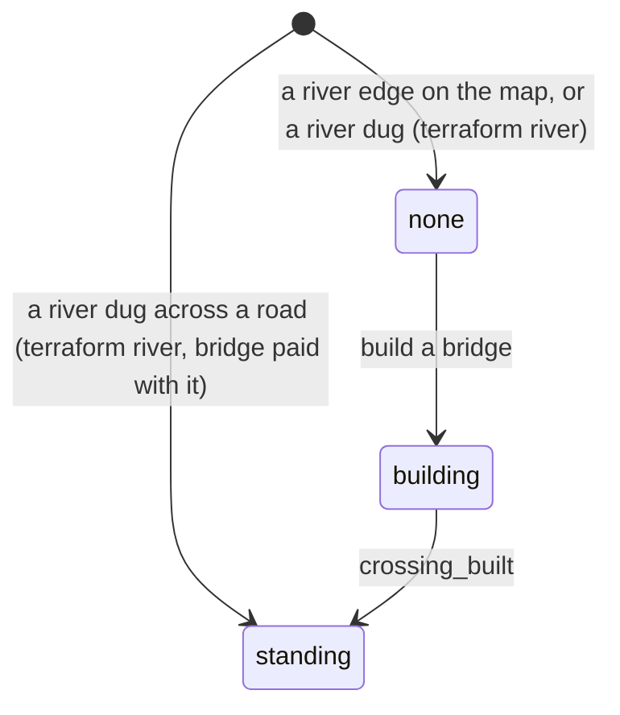
```mermaid
stateDiagram-v2
  [*] --> none: a river edge on the map, or a river dug (terraform river)
  [*] --> standing: a river dug across a road (terraform river, bridge paid with it)
  none --> building: build a bridge
  building --> standing: crossing_built
```

## Fort and supply point

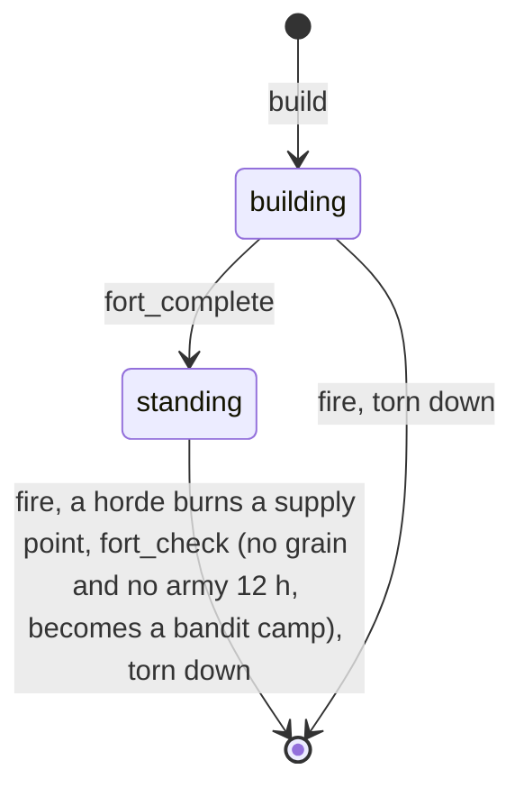
```mermaid
stateDiagram-v2
  [*] --> building: build
  building --> standing: fort_complete
  standing --> [*]: fire, a horde burns a supply point, fort_check (no grain and no army 12 h, becomes a bandit camp), torn down
  building --> [*]: fire, torn down
```

A standing fort also raises its buildings one at a time (`work`, done at
`fort_work_done`); that is not a status.

## Camp

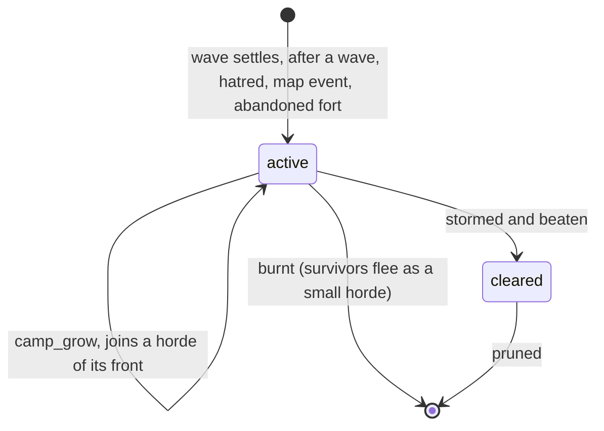
```mermaid
stateDiagram-v2
  [*] --> active: wave settles, after a wave, hatred, map event, abandoned fort
  active --> active: camp_grow, joins a horde of its front
  active --> cleared: stormed and beaten
  active --> [*]: burnt (survivors flee as a small horde)
  cleared --> [*]: pruned
```

## Ancient site

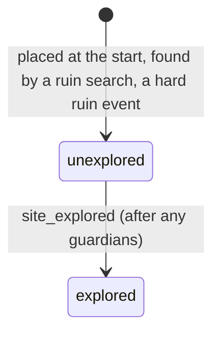
```mermaid
stateDiagram-v2
  [*] --> unexplored: placed at the start, found by a ruin search, a hard ruin event
  unexplored --> explored: site_explored (after any guardians)
```

## Shipyard and mountain city

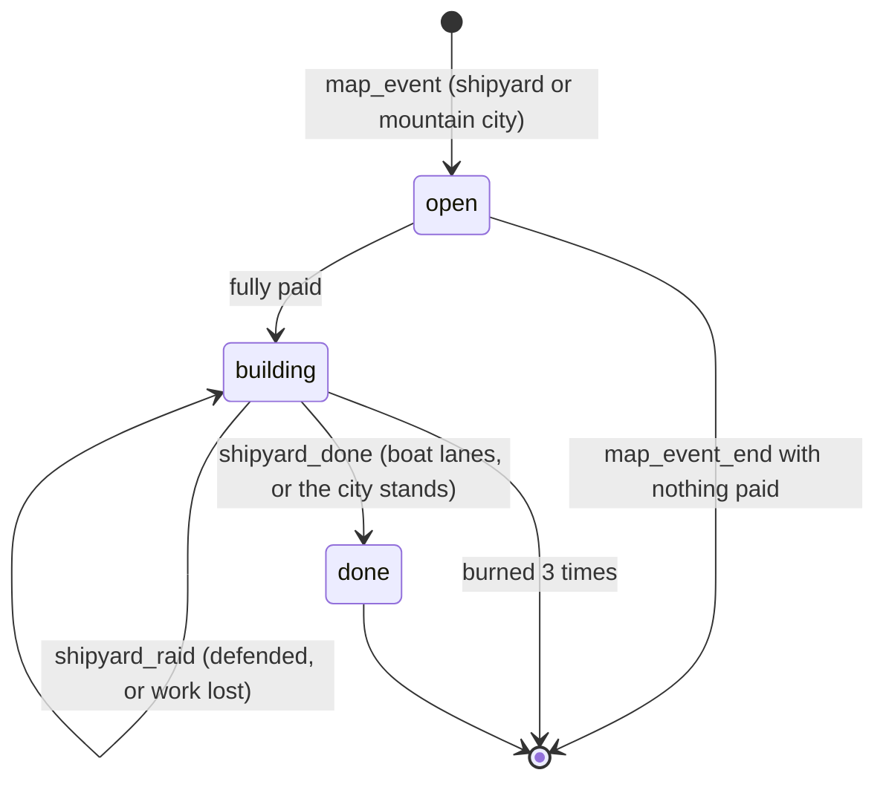
```mermaid
stateDiagram-v2
  [*] --> open: map_event (shipyard or mountain city)
  open --> building: fully paid
  open --> [*]: map_event_end with nothing paid
  building --> building: shipyard_raid (defended, or work lost)
  building --> done: shipyard_done (boat lanes, or the city stands)
  building --> [*]: burned 3 times
  done --> [*]
```

## Research

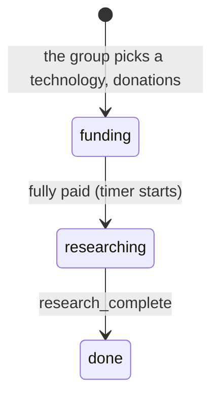
```mermaid
stateDiagram-v2
  [*] --> funding: the group picks a technology, donations
  funding --> researching: fully paid (timer starts)
  researching --> done: research_complete
```

## Kalinov Bridge

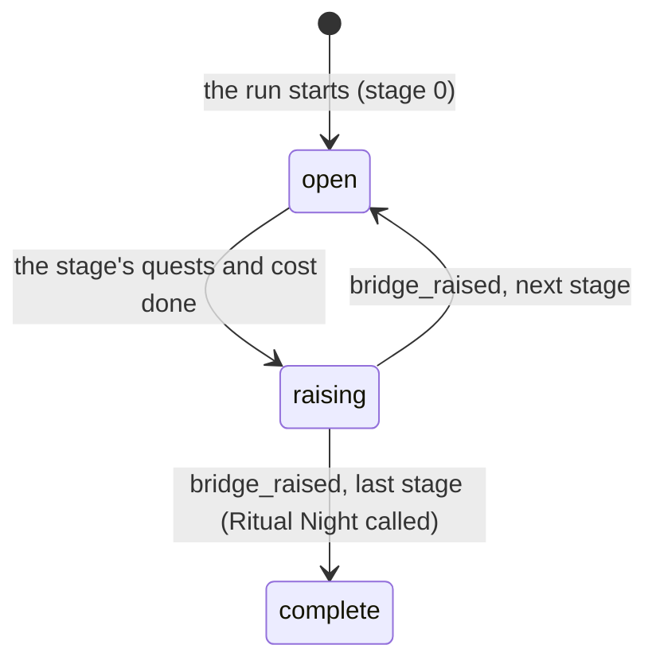
```mermaid
stateDiagram-v2
  [*] --> open: the run starts (stage 0)
  open --> raising: the stage's quests and cost done
  raising --> open: bridge_raised, next stage
  raising --> complete: bridge_raised, last stage (Ritual Night called)
```

## Enemy leader

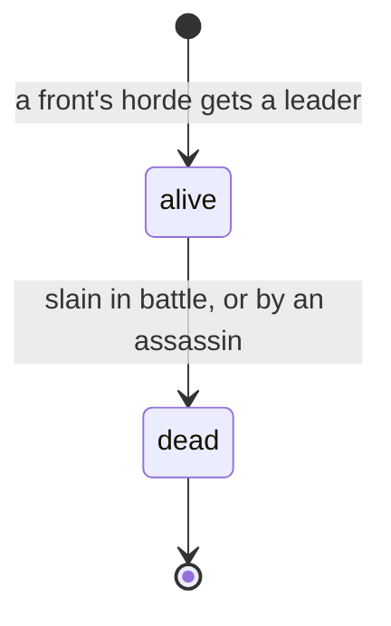
```mermaid
stateDiagram-v2
  [*] --> alive: a front's horde gets a leader
  alive --> dead: slain in battle, or by an assassin
  dead --> [*]
```

A slain leader's rival rises at a third of its level, as a new `alive`
leader.

## Bounty

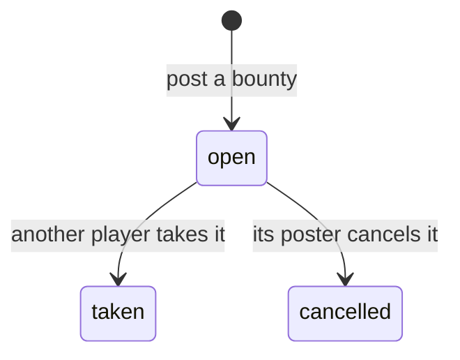
```mermaid
stateDiagram-v2
  [*] --> open: post a bounty
  open --> taken: another player takes it
  open --> cancelled: its poster cancels it
```

## Village

A village has no `status` column. Its state follows from `ruin` and
`refuge`:

```mermaid
stateDiagram-v2
  [*] --> standing: start of the run, settlers found it
  [*] --> refuge: last village razed (refugee camp)
  standing --> ruin: wave_raze, or razed by a player (PvP)
  ruin --> rebuilding: rebuild (paid)
  rebuilding --> standing: village_rebuilt
```

A refugee camp is raided but never razed by a horde. While a village is a
`ruin`, its stores hold at least what rebuilding it costs.
